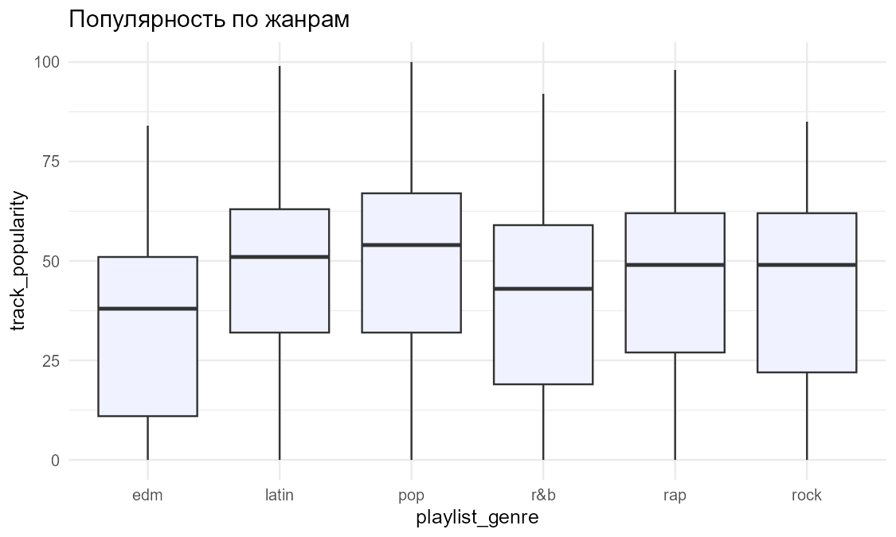
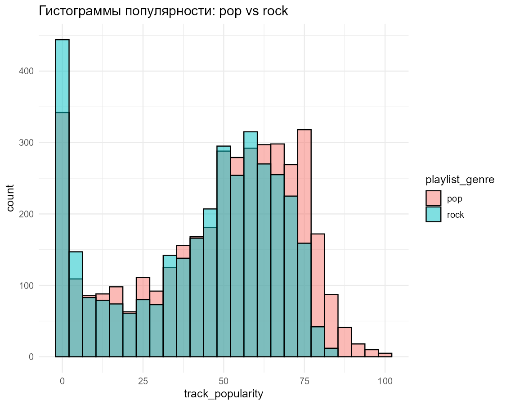

# Spotify Songs: Statistical Analysis in Python & R

End-to-end statistical study of ~18,000 Spotify tracks (6 genres: pop, rock, rap, EDM, R&B, latin), done in **both Python and R** as part of the *Technology Practicum* course at Lomonosov Moscow State University (CMC faculty, semester 5, 2025).

📄 **Full report (71 pages, in Russian):** [`report/report.pdf`](report/report.pdf)

## What's inside

### Stage 1: exploratory analysis
- Descriptive statistics and missing-value analysis
- Kernel density estimates, boxplots, stripcharts, dotcharts and CD-plots
- Outlier detection with the **Grubbs** and **Dixon** tests, applied only after checking the normality assumption
- Normality testing (Shapiro–Wilk, Lilliefors, Anderson–Darling) and Q–Q plots with confidence envelopes
- **Missing-data imputation:** mean vs kNN vs MICE, compared by MSE against the ground truth

### Stage 2: inference and modelling
- **Hypothesis testing:** one- and two-sample t-tests, Wilcoxon–Mann–Whitney, equality-of-variance tests (Bartlett, Levene, Fligner–Killeen), power analysis
- **Correlation:** Pearson, Spearman and Kendall
- **Categorical data:** χ², Fisher's exact test, Cochran–Mantel–Haenszel
- **Multicollinearity:** correlation matrix and VIF
- **ANOVA** with genre × mode interaction
- **Regression:** linear and polynomial models, residual diagnostics

## Key findings
- Pop tracks are significantly more popular than rock tracks (p ≪ 0.01 by both t-test and Mann–Whitney).
- `energy` and `loudness` are strongly correlated (VIF > 10), so one of them must be handled before regression.
- Genre significantly explains popularity (ANOVA), with a genre × mode interaction.
- Audio features alone predict popularity poorly (low R²): popularity depends on much more than how a song sounds.

<p align="center">
  
  
</p>

## Repository structure

| Path | Contents |
|------|----------|
| `stage1_python.ipynb`, `stage2_python.ipynb` | Python analysis (pandas, SciPy, statsmodels, scikit-learn) |
| `stage1_r.Rmd`, `stage2_r.Rmd` | The same analysis in R Markdown |
| `картинки/`, `картинки2/` | Figures produced by Python (stages 1 and 2) |
| `r_figures/`, `r_figures2/` | Figures produced by R (stages 1 and 2) |
| `report/report.pdf` | Final LaTeX report |

## Data

The analysis uses the [Audio features and lyrics of Spotify songs](https://www.kaggle.com/datasets/imuhammad/audio-features-and-lyrics-of-spotify-songs) dataset: 18,454 tracks and 25 columns. Download `spotify_songs.csv` and put it in `data/`:

```
data/spotify_songs.csv
```

## Tech stack
**Python:** pandas, NumPy, SciPy, statsmodels, scikit-learn, Matplotlib, Seaborn  
**R:** tidyverse, ggplot2, car, nortest, outliers, mice, VIM, pwr, corrplot

> The notebooks and the report are written in Russian.
